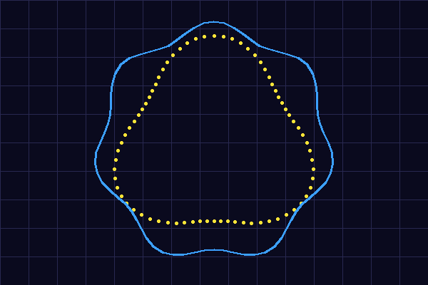

# LiDARProcessor

LiDARProcessor is a standalone C++20 application that replays Velodyne `.pcap` traces, converts the packets into `(x,y,z)` point clouds via a DAT-compatible reader, and renders the result with OpenGL + ImGui controls.

## Overview
- `test/main.cpp` finds `data/testCase.pcap` (relative to the binary or an overridden path), instantiates a Velodyne sensor implementation, and wires it through `LidarEngine` to the visualizer loop.
- `VelodyneLidar` wraps `reader/src/VelodynePCAPReader.cpp`, keeps the HDL32/VLP16 geometry tables, and exposes `BaseLidarSensor::PointCloud` batches for the engine to replay at the configured rate.
- `Visualizer` uploads ground/non-ground points, exposes camera presets and ImGui controls, and now overlays the virtual sensor and free-space hulls that respect the vehicle contour and contour inflation logic.

## Building
1. Install [Conan 2.x](https://docs.conan.io/en/latest/) and ensure `cmake` is on your path.
2. Run the helper script:
   ```bat
   run_debug.bat
   ```
   This removes `build/`, runs `conan install . --output-folder=build --build=missing --settings build_type=Debug`, configures via CMake with the generated toolchain, builds `LiDARProcessor`, copies `shaders/` and `data/` into `build/Debug/`, and finally runs the executable.
3. Alternatively run the steps manually:
   ```bat
   conan install . --output-folder=build --build=missing --settings build_type=Debug
   cmake -S . -B build -G "Visual Studio 17 2022" -DCMAKE_TOOLCHAIN_FILE=build/conan_toolchain.cmake
   cmake --build build --config Debug
   ```
4. Dependencies: Eigen3, GLFW, GLEW, GLM, ImGui, and the system OpenGL targets (`conanfile.py`, `CMakeLists.txt`).

## Running
- Launch `build/Debug/LiDARProcessor.exe` (or rely on `run_debug.bat`, which already calls the executable after building).
- The console prints `Preparing sensor <identifier>` and the GLFW window opens with the point cloud, grid, and captioned ImGui overlay.
- ImGui exposes camera selection, replay speed, color/alpha controls, clipping, world visualization toggles, and altitude zone sliders (`visualization/Visualizer.cpp:330-520`).

## Visualizer Experience
- Rendering splits ground and non-ground buffers so you can control their transparency/hue independently while the shader regularly receives min/max height plus classification uniforms (`visualization/Visualizer.cpp:127-189`, `shaders/point.fs:20-88`).
- In **Classification + Free Orbit** the legend maps each point into one of five altitude zones (`z < -1.75 m`, `-1.75 m <= z < -1.50 m`, ..., `z >= 1.75 m`) and colors them accordingly (`visualization/Visualizer.cpp:18-380`, `shaders/point.fs:7-88`).
- Height and intensity palettes transition between cool/warm colors as you scrub the `Clip height` and `Clip intensity` sliders, and the stats window updates totals for total/ground/non-ground points plus the GPU buffer capacity (`visualization/Visualizer.cpp:115-189`).

## Visualizer Usage
- Enable **World visualization** to draw the ground grid, contour, and sensor overlays; adjust `Point size`, `Ground/non-ground plane`, and color palettes before enabling the map overlays for clarity.
- Toggle **Show virtual sensor map** to draw the pink/purple sensor cones plus the ground hull, and **Show free-space map** to highlight yellow coverage sectors that extend up to the nearest measurement in each angular bin; enable **Show B-spline freespace map** to smooth those 72 samples with the Splinter builder and render a single blue polygonal boundary that tracks the same coverage at higher fidelity (`visualization/Visualizer.cpp:560-900`).
- Use the `Ground height threshold` slider (±20 m range) to calibrate floor detection; the default `-1.208 m` works best for the provided capture, the reader respects `kVirtualSensorMaxRange`, and the mapper shares the camera offset via `setSensorOffset` so ISO comparisons stay aligned (`visualization/Visualizer.cpp:458-466`, `mapping/LidarVirtualSensorMapping.cpp:27-52`).
- The vehicle contour is inflated immediately after loading the INI profile by `(0.1 m, 0.1 m)` so hulls keep a safe margin before testing points (`visualization/Visualizer.cpp:308-317`).
- Choose a camera mode (Free Orbit, Bird's Eye, Front, Side, Rear) or orbit freely; the scroll wheel zoom range stays between 0.5 m and 200 m, and mouse drag sets yaw/pitch while clamping pitch to ±89° (`visualization/Visualizer.cpp:780-861`). The default camera distance is 0.5 m and replay speed 0.1 to match the fine-grained playback.
- The stats window reflects map toggles, letting you verify how hull updates shift when new contour offsets are applied.

## Project Structure
- `architecture/` contains the system overview you are reading now.
- `reader/` hosts the DAT-derived reader and `VDYNE::LidarScan_t` definitions.
- `velodyne/` holds the sensor implementations (`VelodyneLidar.cpp`), engine (`LidarEngine.cpp`), and factory helper.
- `visualization/` manages the OpenGL renderer, shader wrapper, ImGui UI, and new contour-aware sensor mapping logic.
- `shaders/` stores `point.vs/.fs`, which color points by height/intensity/classification.
- `data/` provides `testCase.pcap` captures, vehicle INI profiles, and visualization settings.
- `splinter/` bundles the Splinter B-spline builder sources that the visualizer uses to smooth the freespace boundary.

## Observing the Output
- After running `run_debug.bat`, inspect `build/Debug/` for the executable plus the copied `shaders/` and `data/` directories so future runs can start from the build folder.
- Flip camera views, adjust zoom, and switch color modes to observe how the altitude zone legend plus stats window react to live scans.

## B-spline Freespace Map
- The Splinter builder now consumes 10 subdivisions per angular sector (~720 samples) instead of one per bin, fits 720+ basis functions with cubic or higher degree, and evaluates the spline across that dense parameter range to produce the blue freespace boundary you can toggle with **Show B-spline freespace map**; the color-coded overlay and controls are wired through `visualization/Visualizer.cpp` plus the `splinter/` sources so every frame reuses the latest scan buffer.
- `docs/figures/bspline_freespace.png` illustrates the difference: the yellow measurements (sector midpoints) stay close to the blue spline hull, and filtering by `Ground height threshold` plus the default replay speed 0.1 gives the smoothest reconstruction.

## Visual Reference

Figure 1: The LiDAR point cloud colored by the current palette and split into ground/non-ground buffers.


Figure 2: Yellow coverage sectors show the maximum measurement range per virtual sensor bin, respecting `kVirtualSensorMaxRange`.


Figure 3: Freespace mapping.


Figure 4: The blue B-spline freespace boundary (right) follows the yellow sector measurements (left) after applying the Splinter builder to the 720 subdivided samples.

## LiDAR Ecosystem & Roadmap
- **Current support**: Velodyne HDL/VLP sensors via `reader/src/VelodynePCAPReader.cpp`; new drivers can reuse the `BaseLidarSensor` interface.
- **LiDAR manufacturers to watch**:
  - Velodyne LiDAR – established 3D LiDAR leader (part of Ouster).
  - Ouster – digital solid-state LiDAR for automotive, industrial, robotics.
  - RoboSense – Chinese automotive LiDAR provider.
  - Hesai Technology – high-performance LiDAR manufacturer.
  - Innoviz Technologies – solid-state automotive LiDAR supplier.
  - Cepton – intelligent LiDAR for vehicles and infrastructure.
  - Aeva Technologies – 4D LiDAR delivering range + velocity.
  - AEye, Inc. – digital/active scanning LiDAR + perception systems.
  - Luminar Technologies – legacy automotive LiDAR.
  - Quanergy Systems – automotive and industrial LiDAR.
  - Ibeo Automotive Systems – early automotive LiDAR pioneer.
  - Benewake – compact LiDAR modules for robotics/automotive.
  - Livox – notable (now discontinued) sensor modules.

## Troubleshooting
- Rerun `conan install . --output-folder=build --build=missing --settings build_type=Debug` if dependencies are missing.
- Ensure `shaders/` and `data/` are copied into the runtime directory; missing shader files usually mean the build folder lacked those assets.
